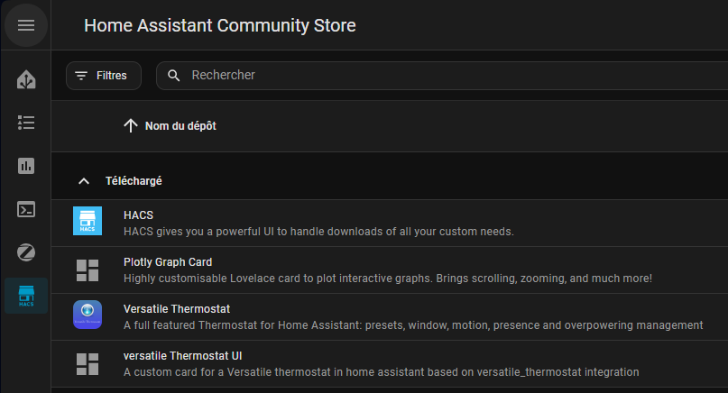
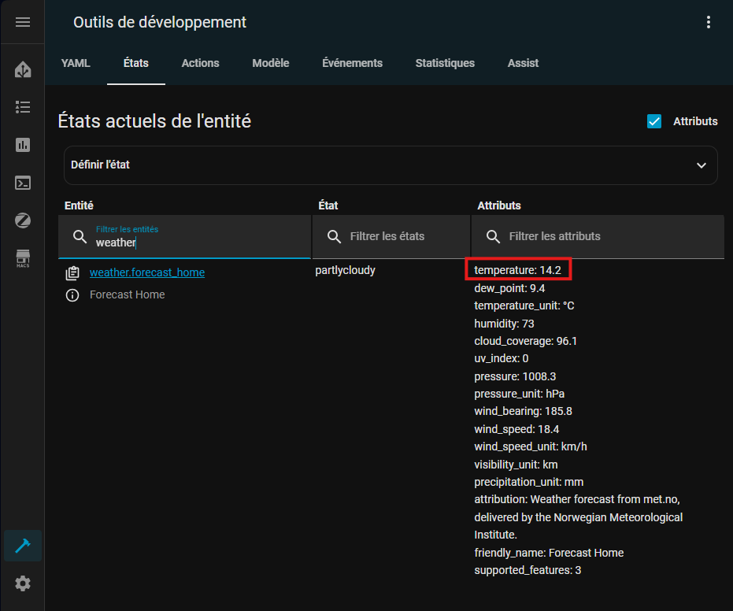
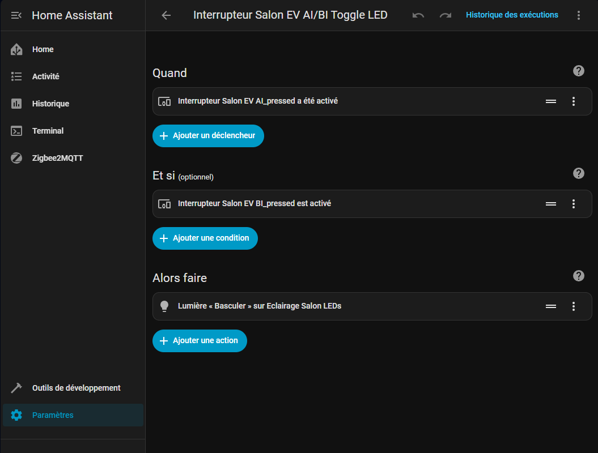
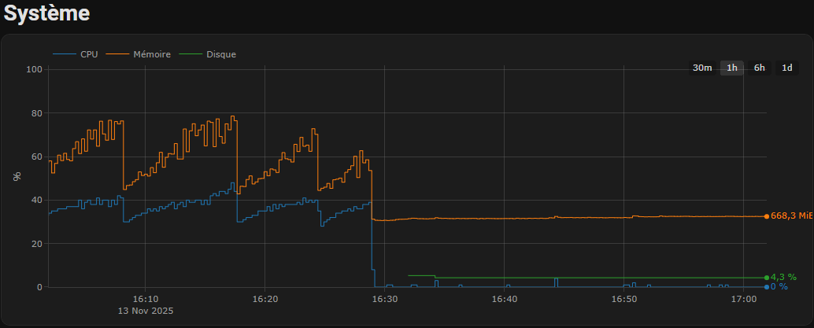
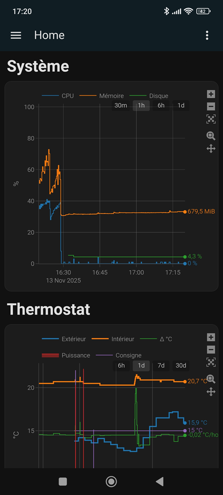

<style>
    s0, s1, s2, s3, s4, s5 {
        display: block;
        color: #FFB000;
        text-align: center;
        font-weight: 600;
    }

    s0::before { content: "☆"; }
    s1::before { content: "★"; }
    s2::before { content: "★★"; }
    s3::before { content: "★★★"; }
    s4::before { content: "★★★★"; }
    s5::before { content: "★★★★★"; }

    note, tip, important, warning, caution, success, error {
        display: flex;
        align-items: stretch;
        box-sizing: border-box;
        padding: 10px;
        padding-right: 5px;
        border-radius: 6px;
        font-family: "Segoe UI";
        line-height: 1; 
    }

    note::before, tip::before, important::before, warning::before, caution::before, success::before, error::before {
        display: flex;
        align-items: center;
        justify-content: center;
        font-size: 18px;
        margin-bottom: 3px;
        margin-right: 5px
    }

    note { border: 1px solid #001ec7ff; background: linear-gradient( #e0e6ff, #c2d2ff); }
    note::before { content:"ℹ️"; }
    tip { border: 1px solid #00a64f; background: linear-gradient( #e0ffe8, #c2ffd2); }
    tip::before { content:"💡"; }
    important { border: 1px solid #7a00c7; background: linear-gradient( #f0e0ff, #e0c2ff); }
    important::before { content:"❗️"; }
    warning { border: 1px solid #c79a00; background: linear-gradient( #fff8e0, #fff4c2); }
    warning::before { margin-top: -3px; content: "⚠️"; }
    caution { border: 1px solid #c70000ff; background: linear-gradient( #ffe0e0, #ffc2c2); }
    caution::before { content:"❌"; }
    success { border: 1px solid #38c700ff; background: linear-gradient( #e6ffe0, #c9ffc2); }
    success::before { content:"✅"; }
    error { border: 1px solid #c70000ff; background: linear-gradient( #ffe0e0, #ffc2c2); }
    error::before { content:"❌"; }
</style>

# Préface

Ce document a pour but de centraliser les connaissances sur la maintenance de la domotique installée par Bouygues dans le cadre de Flexom.
Avec la fin du service Flexom et la reprise par Building Care de la maintenance du système, une réflexion sur les alternatives a été amorcée.


## Technologies

* EnOcean : Protocole open-source en perte de vitesse.
* Zigbee : Protocole open-source supporté par une large variété d'équipements.
* RTS : Protocole propriétaire Somfy utilisé par le thermostat.
* IO : Protocole propriétaire Somfy utilisé par les volets roulants.

| Technologie | Interopérabilité | Confiance pour une migration | Note                                                  |
| ----------- | ---------------- | ---------------------------- | ----------------------------------------------------- |
| EnOcean     | <s4></s4>        | <s4></s4>                    |                                                       |
| Zigbee      | <s5></s5>        | <s5></s5>                    | Nouveaux équipements uniquement                       |
| RTS         | <s1></s1>        | <s3></s3>                    | Le remplacement total du thermostat est moins onéreux | 
| IO          | <s0></s0>        | <s0></s0>                    | Aucune garantie de compatibilité                      |

<div style="page-break-after: always;"></div>

## Equipements

| Equipement           | Flexom                           | Building Care | Remplacement (exemples)       |
| -------------------- | -------------------------------- | ------------- | ----------------------------- |
| Système domotique    | Hattara Din Rail (IO, EnOcean)   | ?             | Raspberry PI + dongle USB 300 |
| Interrupteur         | Vimar Plana VITA1001 et VITA1002 | ?             | Interrupteur générique        |
| Eclairage            | Ubiwizz Eclairage EnOcean        | ?             | NodOn Eclairage               |
| Volet Roulant        | Somfy IO ?                       | ?             | NodOn Chauffage               |
| Thermostat           | Somfy Thermostat 5117427A        | ?             | NodOn Capteur de temperature  |
| Fil Pilote chauffage | Somfy Home Motion 5117322A       | ?             | NodOn Fil pilote              |


<div style="page-break-after: always;"></div>

# Remplacement vers un système open-source

## Références de prix

| Equipement           | Remplacement                 | Prix    | Notes                                  |
| -------------------- | ---------------------------- | ------- | -------------------------------------- |
| Système domotique    | Raspberry Pi + SD + chargeur | 80€     |                                        |
| Pont EnOcean         | USB dongle 300 EnOcean       | 50€     |                                        |
| Pont Zigbee          | SONOFF dongle Zigbee         | 25€     |                                        |
| Pont RTS             | Somfy Tahoma switch          | 200€    | Si non-remplacement du thermostat      |
| Pont IO              | Somfy Tahoma switch          | 200€    | Potentiellement impossible à connecter |
| Interrupteur         | Vimar Plana                  | ~65€    |                                        |
| Eclairage            | NodOn Eclairage              | 62€/45€ | EnOcean/Zigbee                         |
| Volet Roulant        | NodOn Volet Roulant          | 57€/45€ | EnOcean/Zigbee                         |
| Thermostat           | NodOn Capteur de temperature | 55€/50€ | EnOcean/Zigbee                         |
| Thermostat           | SONOFF SNZB-02D              | 20€     | Alternative Zigbee                     |
| Fil Pilote chauffage | NodOn Fil pilote             | 55€/47€ | EnOcean/Zigbee                         |

<div style="page-break-after: always;"></div>

## Solutions

| Solution       | Interopérabilité | Facilité de migration | Cout      | Note                                           |
| -------------- | ---------------- | --------------------- | --------- | ---------------------------------------------- |
| Building Care  | <s1></s1>        | <s5></s5>             | <s0></s0> | 100€/an + tributaire de Building Care          |
| Sans domotique | <s0></s0>        | <s5></s5>             | <s5></s5> | Remplacement des équipements au fil des pannes |
| Minimale       | <s4></s4>        | <s3></s3>             | <s3></s3> | Possiblement impossible                        |
| EnOcean        | <s4></s4>        | <s2></s2>             | <s1></s1> |                                                |
| Mixte          | <s5></s5>        | <s2></s2>             | <s2></s2> |                                                |

<div style="page-break-after: always;"></div>

### Solution sans domotique


#### Evaluation des couts

| Equipement           | Remplacement                 | Cout  | Quantité | Total |
| -------------------- | ---------------------------- | ----- | -------- | ----- |
| Système domotique    | Raspberry Pi                 | 80€   | 1        | 80€   |
| Pont EnOcean         | USB dongle 300 EnOcean       | 50€   | 1        | 50€   |
| **Total**            |                              |       |          | 130€  |

<div style="page-break-after: always;"></div>

### Solution minimale

<warning>Cette solution part du principe que la box Tahoma Switch peut se connecter aux volets roulants.</warning>


#### Evaluation des couts

| Equipement           | Remplacement                 | Cout  | Quantité | Total |
| -------------------- | ---------------------------- | ----- | -------- | ----- |
| Système domotique    | Raspberry Pi                 | 80€   | 1        | 80€   |
| Pont EnOcean         | USB dongle 300 EnOcean       | 50€   | 1        | 50€   |
| Pont IO/RTS          | Somfy Tahoma switch          | 200€  | 1        | 200€  |
| **Total**            |                              |       |          | 330€  |

<div style="page-break-after: always;"></div>

### Solution EnOcean

Cette solution utilise en intégralité le protocole EnOcean et est totalement homogène.


#### Evaluation des couts

| Equipement           | Remplacement                 | Cout | Quantité | Total |
| -------------------- | ---------------------------- | ---- | -------- | ----- |
| Système domotique    | Raspberry Pi                 | 80€  | 1        | 80€   |
| Pont EnOcean         | USB dongle 300 EnOcean       | 50€  | 1        | 50€   |
| Volet Roulant        | NodOn Volet Roulant          | 57€  | 7        | 399€  |
| Thermostat           | NodOn Capteur de temperature | 55€  | 1        | 55€   |
| Fil Pilote chauffage | NodOn Fil pilote             | 55€  | 1        | 55€   |
| **Total**            |                              |      |          | 639€  |

<div style="page-break-after: always;"></div>

### Solution mixte

Au vu de la popularité de EnOcean par rapport à Zigbee, un modèle utilisant les 2 protocoles est possible. L'installation n'est pas plus compliquée qu'un système EnOcean et la plupart des appareils sont moins cher.


#### Evaluation des couts

| Equipement           | Remplacement                 | Cout | Quantité | Total |
| -------------------- | ---------------------------- | ---- | -------- | ----- |
| Système domotique    | Raspberry Pi                 | 80€  | 1        | 80€   |
| Pont EnOcean         | USB dongle 300 EnOcean       | 50€  | 1        | 50€   |
| Pont Zigbee          | SONOFF dongle Zigbee         | 25€  | 1        | 25€   |
| Volet Roulant        | NodOn Volet Roulant          | 45€  | 7        | 315€  |
| Thermostat           | SONOFF SNZB-02D              | 20€  | 1        | 20€   |
| Fil Pilote chauffage | NodOn Fil pilote             | 47€  | 1        | 47€   |
| **Total**            |                              |      |          | 537€  |

<div style="page-break-after: always;"></div>

# Installation

Pour le système de domotique j'ai choisi la Raspberry Pi et `Home Assistant` qui sont des produits très bien supportés par la communauté open-source.
Des Box domotiques préinstallées sont disponibles sur le marché à un cout supérieur et sont moins flexibles en cas de panne.

<note>Toutes les références sont proposées à titre indicatif.</note>

## Mise en place du système domotique

Requiert:
* Raspberry Pi 5 - 2Go ([Farnell](https://fr.farnell.com/raspberry-pi/rpi5-2gb-single/raspberry-pi-5-model-b-2gb-2-4ghz/dp/4531087))
* Alimentation 25W fiche Europe ([Farnell](https://fr.farnell.com/raspberry-pi/sc1157/alimentation-usb-c-5-1v-5a-noire/dp/4263045))
* USB dongle 300 EnOcean ([Farnell](https://fr.farnell.com/enocean/usb-300/passerelle-usb-pour-radio-868mhz/dp/2342011)) ou Pi Hat EnOcean([Domadoo](https://www.domadoo.fr/fr/dongle-enocean/2466-enocean-module-radio-enocean-pi-868mhz.html))
* Carte SD 128Go Classe A2 ([Amazon](https://www.amazon.fr/SanDisk-microSDXC-Adaptateur-RescuePRO-Performance/dp/B09X7DNF6G))

Options:
* Boitier DIN Rail pour Raspberry Pi ([Amazon](www.amazon.fr/GeeekPi-Raspberry-Boîtier-Cooling-Electrical/dp/B0D19T5NYP))
* SONOFF dongle Zigbee ([Amazon](https://www.amazon.fr/SONOFF-Coordinator-Universelle-Passerelle-Assistant/dp/B09KXTCMSC))

* Suivez le guide d'installation de [Home Assistant](https://www.home-assistant.io/installation/raspberrypi).

### Zigbee

Pour l'intégration Zigbee, le plugin `Zigbee2MQTT` est réputée plus stable que le plugin officiel `ZHA`.

* Suivez le processus d'installation de [Zigbee2MQTT](https://www.hacf.fr/zigbee2mqtt-config).
  * Dans les intégrations, commencez par désactiver `ZHA`
  * Allez sur la page d'installation des plugins:

  * Installez `Mosquitto` et `Zigbee2MQTT`:
    * `Mosquitto`:
    [](https://my.home-assistant.io/redirect/supervisor_addon/?addon=core_mosquitto)
    * `Zigbee2MQTT`:
      [](https://my.home-assistant.io/redirect/supervisor_add_addon_repository/?repository_url=https://github.com/zigbee2mqtt/hassio-zigbee2mqtt)


    
  * Allez sur la page de configuration de `Mosquitto` puis `Zigbee2MQTT` pour les démarrer et les configurer:
    
  * Choisissez le dongle Zigbee:
    
  * Une fois démarré, allez de nouveau sur l'interface `Zigbee2MQTT` et activez la découverte d'appareils:
    
  * Ajoutez et renommez vos équipements:
    


### EnOcean

L'intégration par défaut de `EnOcean` pour Home Assistant nécessite une configuration complexe des équipements, nous allons donc en utiliser une autre. L'intégration EnOcean choisie se base aussi sur l'architecture `MQTT` et est sortie en version 1.0 en octobre 2025.

* Suivez le processus d'installation de [EnOceanMQTT](https://github.com/ChristopheHD/HA_enoceanmqtt-addon)
  * Allez sur la page d'installation des plugins:

  * Installez `Mosquitto` si ce n'est pas déjà fait, l'éditeur éditeur de texte et `EnOceanMQTT`:
    * `Mosquitto`:
      [](https://my.home-assistant.io/redirect/supervisor_addon/?addon=core_mosquitto)
    * Editeur simple:
      [](https://my.home-assistant.io/redirect/supervisor_addon/?addon=core_configurator)
    * `EnOceanMQTT`:
      [](https://my.home-assistant.io/redirect/supervisor_add_addon_repository/?repository_url=https://github.com/ChristopheHD/HA_enoceanmqtt-addon)
    


#### Récupération des IDs EnOcean

  vous disposez de 3 méthodes.
<warning>Il est recommandé de récupérer l'adresse de la passerelle avant l'arrêt des services Flexom. Vous devrez changer le BaseID de votre clé pour correspondre à la passerelle.</warning>

* Le code est écrit à l'arrière des interrupteurs ou sur les éclairages.
* Il est disponible sur l'application Flexom depuis le menu suivant:
`Menu principal`  → `Fonctions avancées, Paramètres` → `Mes objets`
Puis `Objets` → `<objet>` → `Infos` → `Détails` → `ComID`
* Depuis les logs de l'application, quand vous appuyez sur un interrupteur, l'interrupteur et l'éclairage envoient des informations:

* Créez et éditez le fichier `enoceanmqtt.devices`

Les interrupteurs utilisent le code EEP F6-02-01 et les éclairages le code EEP D2-01-12.
```yaml
[interrupteur_chambre_1]
address         = 0xDEADBEEF
rorg            = 0xF6
func            = 0x02
type            = 0x01

[eclairage_chambre_1]
address         = 0xABADC0DE
rorg            = 0xD2
func            = 0x01
type            = 0x12
```
* Pour changer le BaseID de votre clé, téléchargez le logiciel [Dolphin View](https://www.enocean.com/en/product/dolphinview) (nécessite de créer un compte).
* Ouvrez le logiciel et exécutez les commandes comme décrites sur l'image.
<caution>Le changement de BaseID est limité à 10 fois sur les clés EnOcean.</caution>
La commande en vert permet de récupérer l'ID courant de la clé.
La commande en rouge permet de changer l'ID de la clé. Utilisez l'ID votre ancienne passerelle.

* Réaffectez et renommez les appareils créés:

* Une fois la migration effectuée, vous pourrez controller vos luminaires depuis `Home Assistant`.


## Connection à distance

### Via VPN

La connection à distance via VPN est la solution sécurisée la plus simple à mettre en place.
Nous utiliserons [WireGuard](https://github.com/hassio-addons/addon-wireguard/blob/main/wireguard/DOCS.md) qui dispose d'une intégration officielle.

* Installez `WireGuard`
[](https://my.home-assistant.io/redirect/supervisor_addon/?addon=a0d7b954_wireguard)
* Récupérez votre adresse IPv4 : https://whatismyipaddress.com
* Dans la page de configuration de `WireGuard`, remplacez le serveur par votre adresse
* Ajoutez des utilisateurs dans la section `Peers`
* Activez la redirection de port de votre routeur vers `WireGuard`
  * https://www.lesalexiens.fr/tutoriels/duckdns-acceder-home-assistant-exterieur-distance
* Téléchargez le fichier `/ssl/wireguard/<user>/qrcode.png` sur votre ordinateur
* Téléchargez `WireGuard` sur votre smartphone
* Importez le QR code dans `WireGuard`
* Connectez-vous normalement à `Home Assistant`.

<note>Si l'adresse IP de votre box change, il vous sera nécessaire d'utiliser un service DynDNS tel que DuckDNS.</note>

<warning>En utilisant le VPN, tout le traffic de votre smartphone passera par votre Raspberry PI. Si votre connection devient lente, limitez l'utilisation du VPN à vos usages Home Assistant.</warning>

## Remplacement du thermostat

Pour la partie thermostat, nous allons utiliser [Versatile Thermostat](https://github.com/jmcollin78/versatile_thermostat/blob/main/README-fr.md). L'installation se fait à l'aide de [HACS](https://hacs.xyz).

Requiert:
* Capteur de température

Options:
* Fil pilote (remplace le fil pilote Somfy de votre tableau électrique)
* Détecteurs d'ouverture de fenêtre

### Mise en place

* Suivez le guide d'installation de [HACS](https://hacs.xyz/docs/use/configuration/basic)
* Dans `HACS`, ajoutez les modules suivants:
  * `Versatile Thermostat` et `Versatile Thermostat UI`
  * `Plotly Graph Card` pour afficher de jolis graphes

 * Redémarrez `Home Assistant` une fois les modules installés

Nous aurons besoin de quelques capteurs supplémentaires pour la configuration de `Versatile Thermostat`.
* Dans la configuration `config/configuration.yaml` YAML, ajoutez la ligne suivante:
`template: !include template.yaml`.
* Dans ce nouveau fichier, ajoutez un capteur reprenant les informations météo internet
* Nous en profiterons pour ajouter un capteur de température de consigne que nous afficherons dans le graphe
```yaml
# Début du fichier config/template.yaml
- sensor:
  - name: "Température extérieure"
    unique_id: template_temperature_external
    device_class: temperature
    unit_of_measurement: "°C"
    # Capteur météo en provenance d'internet
    state: "{{ state_attr('weather.forecast_home', 'temperature') }}"
    icon: mdi:home-thermometer-outline

  - name: "Température consigne"
    unique_id: template_temperature_target
    device_class: temperature
    unit_of_measurement: "°C"
    # Récupération de la consigne du thermostat que nous allons créer
    state: "{{ state_attr('climate.vtherm', 'temperature') }}"
    icon: mdi:thermostat-cog
```
* Les noms des entités sont disponibles dans `Outils de développement` → `Etats`

* Vérifiez la configuration à partir du menu `Outils de développement` et redémarrez `Home Assistant`.
* Créez le thermostat : `Paramètres` → `Appareils et services` → `Ajouter une intégration`
* Puis `Versatile Thermostat` → `Thermostat sur un switch`
* Remplissez les [information nécessaires](https://github.com/jmcollin78/versatile_thermostat/blob/main/documentation/fr/base-attributes.md):
  * Nom: `VTherm`
  * Capteur de température
  * Durée du cycle: `15`
  * Capteur de température extérieure: `Température extérieure`
* Remplissez le [sous-jacent](https://github.com/jmcollin78/versatile_thermostat/blob/main/documentation/fr/over-switch.md#configuration) (fil pilote)
<tip>Pour tester la fonctionnalité, il n'est pas nécessaire de posséder l'équipement. Vous pouvez en créer un virtuel sur cette fenêtre de configuration.</tip>
* Ajoutez la fonction de détection de fenêtre, si vous n'avez pas de capteur, cette fonctionnalité s'enclenchera sur une chute de température de plus de 3°C/h.
* Validez la création du thermostat.
* Si le nom de votre thermostat est différent de `VTherm`, modifiez le fichier de configuration `config/template.yaml` en accord avec ce nouveau nom.

Il est toujours possible de modifier le thermostat créé à partir de `Paramètres` → `Appareils et services` → `Versatile Thermostat configuration`.

### Tableau de bord

Un tableau de bord peut permettre de rapidement valider le comportement de notre thermostat.

* Allez dans `Paramètres` → `Tableaux de bord` → `Ajouter un tableau de bord` → `Tableau de bord vide`
* Dans une nouvelle section, ajoutez les cartes `Versatile Thermostat Climate Card`, `Prévisions météo`, `Plotly Graph Card` et `Markdown`.
* Editez la carte `Markdown` en utilisant le texte `# Thermostat`
* Pour la configuration `Plotly Graph Card`, ouvrez l'éditeur de code et utilisez la configuration suivante:

```yaml
type: custom:plotly-graph
hours_to_show: 24
refresh_interval: 10*
grid_options:
  columns: full
  rows: 6
defaults:
  entity:
    connectgaps: true
    show_value: true
entities:
  - entity: sensor.temperature_exterieure
    name: Extérieur
    line:
      width: 2
  - entity: sensor.thermostat_temperature
    name: Intérieur
    line:
      width: 2
  - entity: sensor.vtherm_temperature_slope
    name: Δ °C
    yaxis: y2
  - entity: sensor.vtherm_power_percent
    name: Puissance
    fill: tozeroy
    yaxis: y3
  - entity: sensor.temperature_consigne
    name: Consigne
layout:
  legend:
    x: 0
    "y": 1
    xanchor: left
    yanchor: bottom
  xaxis:
    rangeselector:
      x: 1.05
      xanchor: right
      yanchor: top
      font:
        color: rgba(255,255,255,0.8)
      bgcolor: rgba(0,0,0,0.2)
      activecolor: rgba(255,255,255,0.1)
      buttons:
        - count: 6
          step: hour
        - count: 1
          step: day
        - count: 7
          step: day
        - count: 30
          step: day
  yaxis2:
    rangemode: tozero
    zeoline: true
    showticklabels: false
    showgrid: false
    showline: false
    ticks: ""
    title: ""
    range:
      - -5
      - 5
    fixedrange: true
  yaxis3:
    visible: false
    range:
      - -2
      - 102
    fixedrange: true
```

* Adaptez les paramètres en fonction de vos besoins.


## Remplacement des éclairages

Les éclairages préinstallés disposent de plusieurs associations :
* L'association point à point avec les interrupteurs (canal 1 avec interrupteur AI et AO par ex.)
* L'association avec la passerelle `EnOcean`

Dans ce cas, la passerelle ne communique pas directement avec les éclairages en cas d'appui sur l'un des boutons. Aucune automatisation n'est nécessaire pour faire fonctionner vos appareils.

Il est cependant possible d'appairer d'autres appareils aux boutons. Les volets roulants sont un exemple :
* `BI` (la touche droite en bas) est associée à `fermer les volets`
* `BO` (la touche droite en haut) est associée à `ouvrir les volets`
* `AO+BO` (les touches en haut) est associée à `arrêter les volets`

Dans l'exemple ci-dessous, nous associons la touche `AI+BI` à la commutation d'un éclairage:
* Allez dans `Paramètres` → `Automatisation` → `Créer une automatisation`
* Associez `AI+BI` à l'action de commutation


<note>Si vous utilisez ce genre d'automatisation, faites attention à l'association des actions simples AI. Il vous faudra ajouter une action AI et non-BI.</note>

## Remplacement des volets roulants

<warning>En cours d'élaboration.</warning>

## Surveillance du système

Si vous avez procédé à l'installation de `HACS` et `Plotly Graph Card`, vous pourrez ajouter une carte du même style pour monitorer votre système.

* Ajoutez l'intégration `Paramètres` → `Appareils et services` → `Ajouter une intégration` → `System Monitor`.
* Activez le monitoring de `Disk usage /`, `Memory use` et `Processor use`.
* Créez une carte `Plotly Graph Card` et collez la configuration suivante:
```yaml
type: custom:plotly-graph
hours_to_show: 1
refresh_interval: 10*
grid_options:
  columns: full
  rows: 6
defaults:
  entity:
    connectgaps: true
    show_value: true
entities:
  - entity: sensor.system_monitor_processor_use
    name: CPU
  - entity: sensor.system_monitor_memory_use
    name: Mémoire
    yaxis: y2
  - entity: sensor.system_monitor_disk_usage
    name: Disque
layout:
  legend:
    x: 0
    "y": 1
    xanchor: left
    yanchor: bottom
  xaxis:
    rangeselector:
      x: 1.05
      xanchor: right
      yanchor: top
      font:
        color: rgba(255,255,255,0.8)
      bgcolor: rgba(0,0,0,0.2)
      activecolor: rgba(255,255,255,0.1)
      buttons:
        - count: 30
          step: minute
        - count: 1
          step: hour
        - count: 6
          step: hour
        - count: 1
          step: day
  yaxis:
    fixedrange: true
    range:
      - 0
      - 102
  yaxis2:
    rangemode: tozero
    visible: false
    fixedrange: true
    range:
      - 0
      - 2100
```
* Adaptez la mémoire en fonction du modèle de Raspberry PI choisi.


### Rendu sur smartphone



# Références

#### Core

* Home Assistant: https://www.home-assistant.io/
* HACS: https://hacs.xyz/docs/use/configuration/basic
* EnOcean: https://www.enocean.com/en/faq-knowledge-base/what-is-difference-between-base-id-and-chip-id/

#### Thermostat

* Versatile Thermostat: https://github.com/jmcollin78/versatile_thermostat

#### Réseau

* IPv4: https://whatismyipaddress.com
* WireGuard: https://github.com/hassio-addons/addon-wireguard/blob/main/wireguard/DOCS.md
* Accès distant: https://smarthomescene.com/top-picks/best-home-assistant-remote-access-methods-compared
* Tuto DuckDNS: https://www.lesalexiens.fr/tutoriels/duckdns-acceder-home-assistant-exterieur-distance