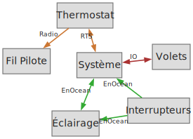
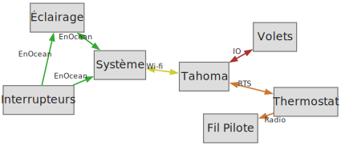
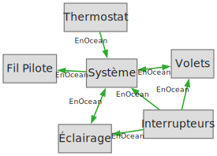
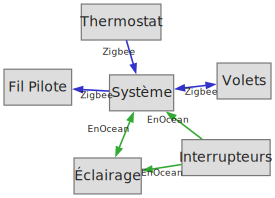

# Préface

Ce document a pour but de centraliser les connaissances sur la maintenance de la domotique installée par Bouygues dans le cadre de Flexom.
Avec la fin du service Flexom et la reprise par Building Care de la maintenance du système, une réflexion sur les alternatives a été amorcée.

## Technologies

* EnOcean : Protocole open-source en perte de vitesse.
* Zigbee : Protocole open-source supporté par une large variété d'équipements.
* RTS : Protocole propriétaire Somfy utilisé par le thermostat.
* IO : Protocole propriétaire Somfy utilisé par les volets roulants.

| Technologie | Interopérabilité | Confiance pour une migration | Note                                                  |
| ----------- | ---------------- | ---------------------------- | ----------------------------------------------------- |
| EnOcean     | <s4></s4>        | <s4></s4>                    |                                                       |
| Zigbee      | <s5></s5>        | <s5></s5>                    | Nouveaux équipements uniquement                       |
| RTS         | <s1></s1>        | <s3></s3>                    | Le remplacement total du thermostat est moins onéreux | 
| IO          | <s0></s0>        | <s0></s0>                    | Aucune garantie de compatibilité                      |

## Equipements

| Equipement           | Flexom                           | Building Care | Remplacement (exemples)       |
| -------------------- | -------------------------------- | ------------- | ----------------------------- |
| Système domotique    | Hattara Din Rail (IO, EnOcean)   | ?             | Raspberry PI + dongle USB 300 |
| Interrupteur         | Vimar Plana VITA1001 et VITA1002 | ?             | Interrupteur générique        |
| Eclairage            | Ubiwizz Eclairage EnOcean        | ?             | NodOn Eclairage               |
| Volet Roulant        | Somfy IO ?                       | ?             | NodOn Chauffage               |
| Thermostat           | Somfy Thermostat 5117427A        | ?             | NodOn Capteur de temperature  |
| Fil Pilote chauffage | Somfy Home Motion 5117322A       | ?             | NodOn Fil pilote              |

# Remplacement vers un système open-source

## Références de prix

| Equipement           | Remplacement                 | Prix    | Notes                                  |
| -------------------- | ---------------------------- | ------- | -------------------------------------- |
| Système domotique    | Raspberry Pi + SD + chargeur | 80€     |                                        |
| Pont EnOcean         | USB dongle 300 EnOcean       | 50€     |                                        |
| Pont Zigbee          | SONOFF dongle Zigbee         | 25€     |                                        |
| Pont RTS             | Somfy Tahoma switch          | 200€    | Si non-remplacement du thermostat      |
| Pont IO              | Somfy Tahoma switch          | 200€    | Potentiellement impossible à connecter |
| Interrupteur         | Vimar Plana                  | ~65€    |                                        |
| Eclairage            | NodOn Eclairage              | 62€/45€ | EnOcean/Zigbee                         |
| Volet Roulant        | NodOn Volet Roulant          | 57€/45€ | EnOcean/Zigbee                         |
| Thermostat           | NodOn Capteur de temperature | 55€/50€ | EnOcean/Zigbee                         |
| Thermostat           | SONOFF SNZB-02D              | 20€     | Alternative Zigbee                     |
| Fil Pilote chauffage | NodOn Fil pilote             | 55€/47€ | EnOcean/Zigbee                         |

## Solutions

| Solution       | Interopérabilité | Facilité de migration | Cout      | Note                                           |
| -------------- | ---------------- | --------------------- | --------- | ---------------------------------------------- |
| Building Care  | <s1></s1>        | <s5></s5>             | <s0></s0> | 100€/an + tributaire de Building Care          |
| Sans domotique | <s0></s0>        | <s5></s5>             | <s5></s5> | Remplacement des équipements au fil des pannes |
| Minimale       | <s4></s4>        | <s3></s3>             | <s3></s3> | Possiblement impossible                        |
| EnOcean        | <s4></s4>        | <s2></s2>             | <s1></s1> |                                                |
| Mixte          | <s5></s5>        | <s2></s2>             | <s2></s2> |                                                |

### Solution sans domotique

#### Evaluation des couts

| Equipement           | Remplacement                 | Cout  | Quantité | Total |
| -------------------- | ---------------------------- | ----- | -------- | ----- |
| Système domotique    | Raspberry Pi                 | 80€   | 1        | 80€   |
| Pont EnOcean         | USB dongle 300 EnOcean       | 50€   | 1        | 50€   |
| **Total**            |                              |       |          | 130€  |

### Solution minimale

<warning>Cette solution part du principe que la box Tahoma Switch peut se connecter aux volets roulants.</warning>

#### Evaluation des couts

| Equipement           | Remplacement                 | Cout  | Quantité | Total |
| -------------------- | ---------------------------- | ----- | -------- | ----- |
| Système domotique    | Raspberry Pi                 | 80€   | 1        | 80€   |
| Pont EnOcean         | USB dongle 300 EnOcean       | 50€   | 1        | 50€   |
| Pont IO/RTS          | Somfy Tahoma switch          | 200€  | 1        | 200€  |
| **Total**            |                              |       |          | 330€  |

### Solution EnOcean

Cette solution utilise en intégralité le protocole EnOcean et est totalement homogène.

#### Evaluation des couts

| Equipement           | Remplacement                 | Cout | Quantité | Total |
| -------------------- | ---------------------------- | ---- | -------- | ----- |
| Système domotique    | Raspberry Pi                 | 80€  | 1        | 80€   |
| Pont EnOcean         | USB dongle 300 EnOcean       | 50€  | 1        | 50€   |
| Volet Roulant        | NodOn Volet Roulant          | 57€  | 7        | 399€  |
| Thermostat           | NodOn Capteur de temperature | 55€  | 1        | 55€   |
| Fil Pilote chauffage | NodOn Fil pilote             | 55€  | 1        | 55€   |
| **Total**            |                              |      |          | 639€  |

### Solution mixte

Au vu de la popularité de EnOcean par rapport à Zigbee, un modèle utilisant les 2 protocoles est possible. L'installation n'est pas plus compliquée qu'un système EnOcean et la plupart des appareils sont moins cher.

#### Evaluation des couts

| Equipement           | Remplacement                 | Cout | Quantité | Total |
| -------------------- | ---------------------------- | ---- | -------- | ----- |
| Système domotique    | Raspberry Pi                 | 80€  | 1        | 80€   |
| Pont EnOcean         | USB dongle 300 EnOcean       | 50€  | 1        | 50€   |
| Pont Zigbee          | SONOFF dongle Zigbee         | 25€  | 1        | 25€   |
| Volet Roulant        | NodOn Volet Roulant          | 45€  | 7        | 315€  |
| Thermostat           | SONOFF SNZB-02D              | 20€  | 1        | 20€   |
| Fil Pilote chauffage | NodOn Fil pilote             | 47€  | 1        | 47€   |
| **Total**            |                              |      |          | 537€  |

# Installation

Pour le système de domotique j'ai choisi la Raspberry Pi et Home Assistant qui sont des produits très bien supportés par la communauté open-source.
Des Box domotiques préinstallées sont disponibles sur le marché à un cout supérieur et sont moins flexibles en cas de panne.

## Mise en place du système domotique

Requiert:
* Raspberry Pi 5 - 2Go ([Farnell](https://fr.farnell.com/raspberry-pi/rpi5-2gb-single/raspberry-pi-5-model-b-2gb-2-4ghz/dp/4531087))
* Alimentation 25W fiche Europe ([Farnell](https://fr.farnell.com/raspberry-pi/sc1157/alimentation-usb-c-5-1v-5a-noire/dp/4263045))
* USB dongle 300 EnOcean ([Farnell](https://fr.farnell.com/enocean/usb-300/passerelle-usb-pour-radio-868mhz/dp/2342011)) ou Pi Hat EnOcean([Domadoo](https://www.domadoo.fr/fr/dongle-enocean/2466-enocean-module-radio-enocean-pi-868mhz.html))
* Carte SD 128Go Classe A2 ([Amazon](https://www.amazon.fr/SanDisk-microSDXC-Adaptateur-RescuePRO-Performance/dp/B09X7DNF6G))

Options:
* Rail Din pour Raspberry Pi ([Amazon](www.amazon.fr/GeeekPi-Raspberry-Boîtier-Cooling-Electrical/dp/B0D19T5NYP))
* SONOFF dongle Zigbee ([Amazon](https://www.amazon.fr/SONOFF-Coordinator-Universelle-Passerelle-Assistant/dp/B09KXTCMSC))

Suivez le guide d'installation [Home Assistant](https://www.home-assistant.io/installation/raspberrypi).

<warning>En cours d'élaboration.</warning>

## Remplacement des volets roulants

<warning>En cours d'élaboration.</warning>

## Remplacement du thermostat

<warning>En cours d'élaboration.</warning>

## Remplacement des éclairages

<warning>En cours d'élaboration.</warning>