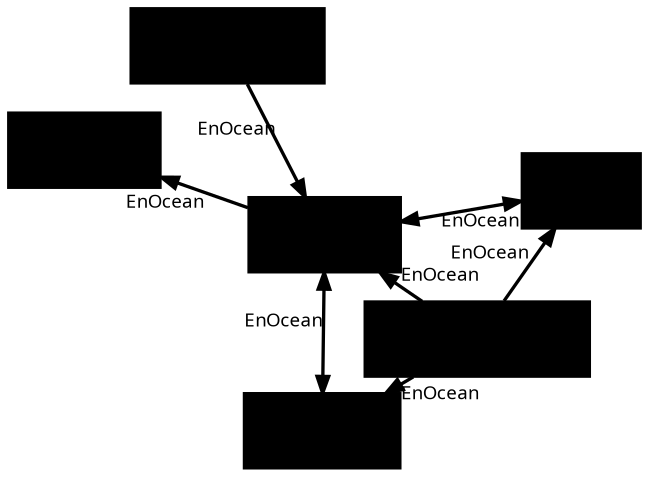

```dot
digraph HomeAutomation {
  layout = neato;
  overlap = false;
  splines = true;

  node [shape=box, style=filled, fillcolor="#ddd", 
      fontcolor="#222", color="#777", penwidth=1.2,
      fontname="Segoe UI"];

  edge [fontname="Segoe UI", fontsize=9, fontcolor="#222",
      arrowsize=0.8, penwidth=1.6];

  s [label="Système"];
  i [label="Interrupteurs"];
  e [label="Éclairage"];
  v [label="Volets"];
  t [label="Thermostat"];
  fp [label="Fil Pilote"];

  i -> s [label="EnOcean", color="#3a3"];
  i -> e [label="EnOcean", color="#3a3"];
  i -> v [label="EnOcean", color="#3a3"];
  s -> e [dir=both, label="EnOcean", color="#3a3"];
  s -> v [dir=both, label="EnOcean", color="#3a3", len=1.3];
  s -> fp [label="EnOcean", color="#3a3", len=1.3];
  t -> s [label="EnOcean", color="#3a3", len=1.1];
  t -> fp [style=invis]
}
```