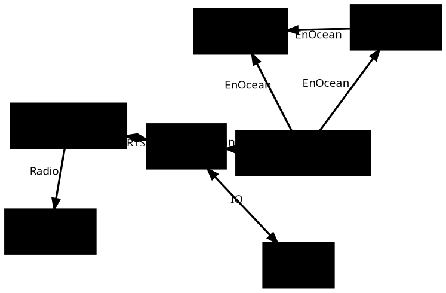

```dot
digraph HomeAutomation {
  layout = neato;
  overlap = false;
  splines = true;

  node [shape=box, style=filled, fillcolor="#ddd", 
      fontcolor="#222", color="#777", penwidth=1.2,
      fontname="Segoe UI"];

  edge [fontname="Segoe UI", fontsize=9, fontcolor="#222",
      arrowsize=0.8, penwidth=1.6];

  f [label="Flexom"];
  s [label="Système"];
  i [label="Interrupteurs"];
  e [label="Éclairage"];
  v [label="Volets"];
  t [label="Thermostat"];
  fp [label="Fil Pilote"];

  i -> f [label="EnOcean", color="#3a3"];
  i -> e [label="EnOcean", color="#3a3", len=1.3];
  i -> s [label="EnOcean", color="#3a3", len=1.3];
  s -> e [label="EnOcean", color="#3a3", len=1.3];
  f -> e [style=invis];
  f -> v [dir=both, label="IO", color="#a33", len=1.3];
  f -> t [dir=both, label="RTS", color="#c73"];
  t -> fp [label="Radio", color="#c73"];
  i -> v [style=invis]
  f -> fp [style=invis, len=1.3]
}
```